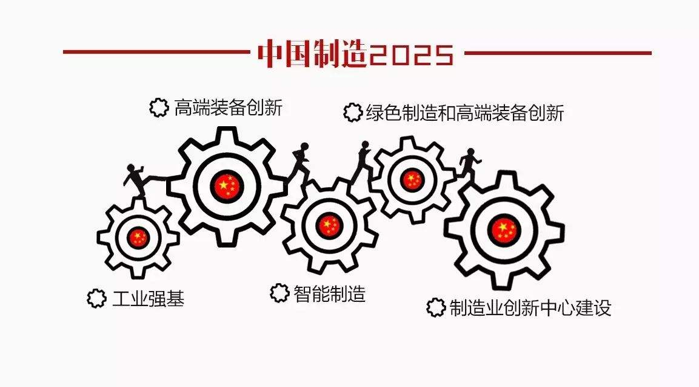
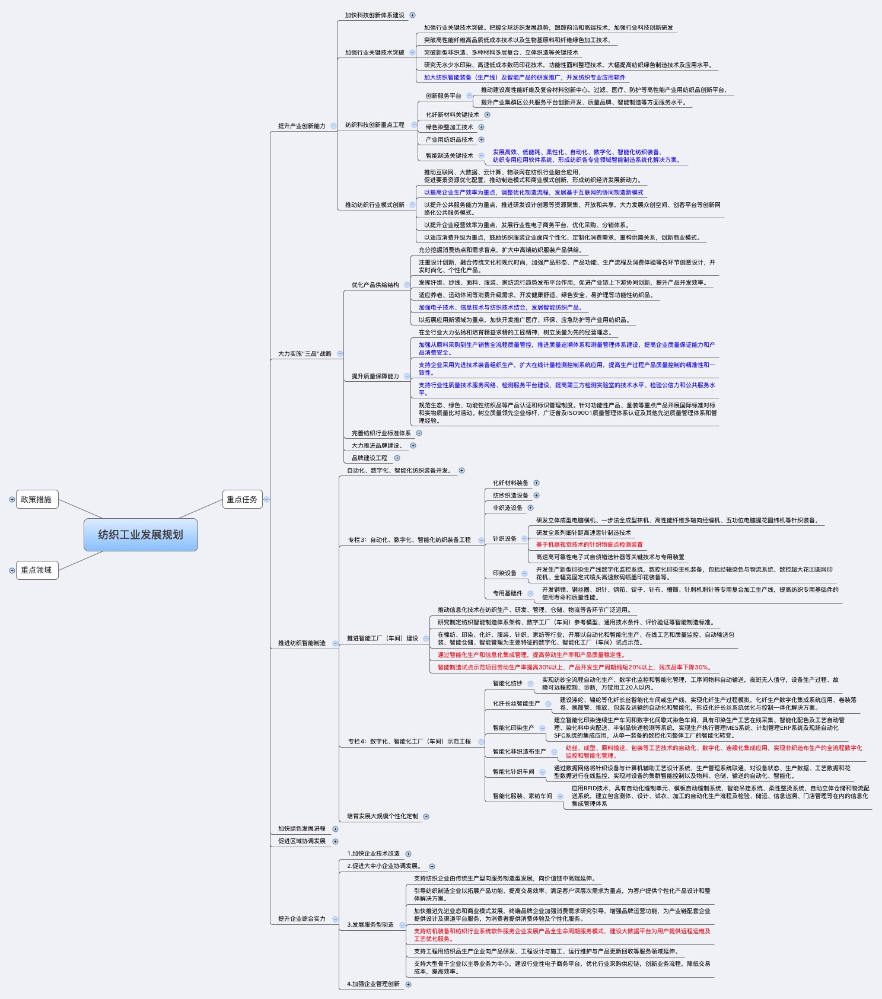
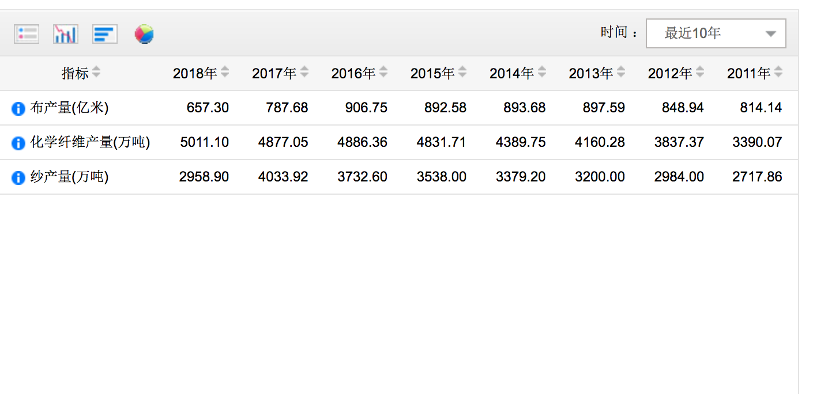
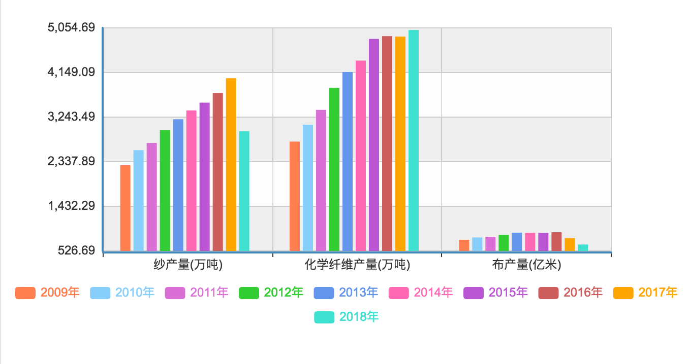
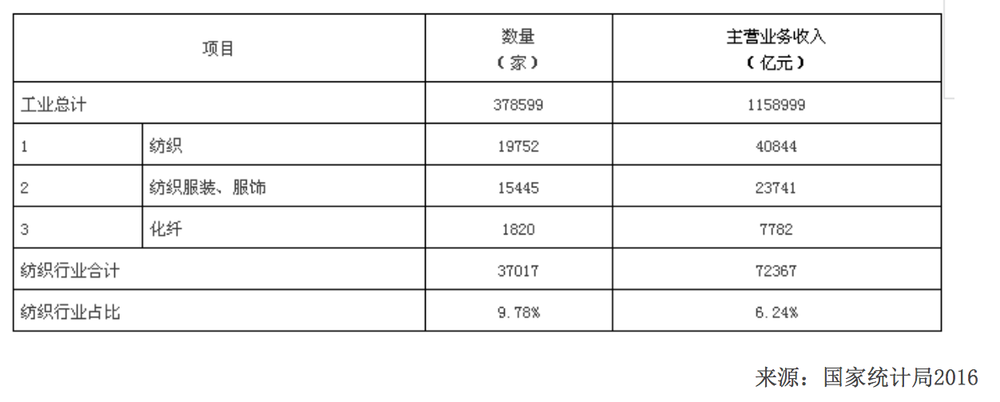
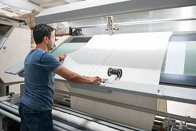
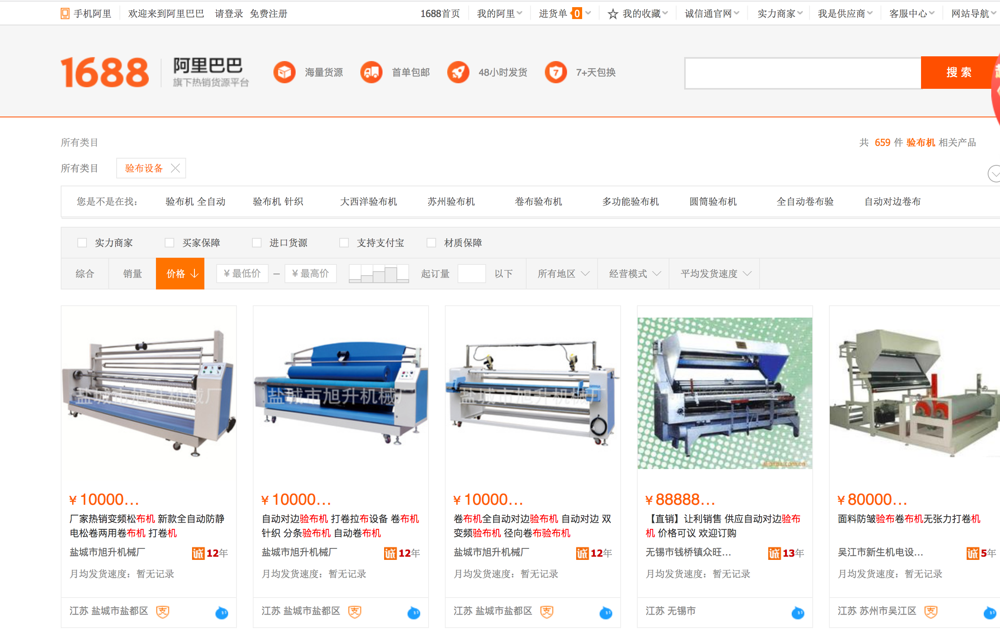

title: 基于AI的外观缺陷检测在纺织行业的应用探索
speaker: wanghaisheng
plugins:
    - echarts

<slide class="bg-black-blue aligncenter" image="https://source.unsplash.com/C1HhAQrbykQ/ .dark">

# 基于AI的外观缺陷检测    {.text-landing.text-shadow}
# 在纺织行业的应用探索 {.text-landing.text-shadow}

By wanghaisheng {.text-intro}

[:fa-github: Github](https://github.com/ksky521/nodeppt){.button.ghost}

<slide class="bg-apple aligncenter">

# 目录
------

:::column

## 第一部分   
## 背景
-----

## 第二部分
## 现状

------
## 第三部分

## 验布

----
## 第四部分

## 思路

:::

<slide class="bg-apple aligncenter">

# 第一部分-背景

<slide class="bg-apple aligncenter">

# 时代大背景-中美对抗
----------
:::card

-----

* 政委金灿荣             
美国曾整垮五个世界老二国家，而中国有一个他们都没有的“优点” 就是中国的制造业。 ​     
http://t.cn/EJ5T98E
* 熵智科技赵青：智能制造之争，是中美历史的重演        
https://36kr.com/p/5153731

:::

<slide class="bg-apple aligncenter">

# 时代大背景-中国制造与智能制造
----------
:::card

-----
* 《中国制造2025》
* 中国制造业的繁荣，是中国屹立于世界的重要原因之一  
工信部部长苗圩在中国发展高层论坛表示，由于老龄化进程加快，     
2012年起中国劳动年龄人口总量开始下降，劳动力成本也在持续快速地上升，           
中国制造的低成本劳动力的优势已经逐渐削弱，必须找到新的发展路径。             
他还提到，中国将全面放开一般制造业。  
:::

<slide class="bg-apple aligncenter">
# 《纺织工业发展规划（2016－2020年）》

---------

<slide class="bg-apple aligncenter">
# 时代大背景-智能制造与纺织服装

---------

:::flexblock

### 技术与产业创新

加大纺织智能装备（生产线）及智能产品的研发推广，开发纺织专业应用软件

发展高效、低能耗、柔性化、自动化、数字化、智能化纺织装备，
纺织专用应用软件系统，形成纺织各专业领域智能制造系统化解决方案。 

以提高企业生产效率为重点，调整优化制造流程，发展基于互联网的协同制造新模式

加强电子技术、信息技术与纺织技术结合，发展智能纺织产品。

---------

### 质量保障

加强从原料采购到生产销售全流程质量管控，推进质量追溯体系和测量管理体系建设，
提高企业质量保证能力和产品消费安全。

支持企业采用先进技术装备组织生产，扩大在线计量检测控制系统应用，
提高生产过程产品质量控制的精准性和一致性。

支持行业性质量技术服务网络、检测服务平台建设，提高第三方检测实验室的技术水平、检验公信力和公共服务水平。s

------------

### 智能制造

基于机器视觉技术的针织物疵点检测装置

提高装备的生产效率、性能功能以及自动化、数字化水平。

通过智能化生产和信息化集成管理，提高劳动生产率和产品质量稳定性。
智能制造试点示范项目劳动生产率提高30%以上，产品开发生产周期缩短20%以上，残次品率下降30%。 

支持纺机装备和纺织行业系统软件服务企业发展产品全生命周期服务模式，建设大数据平台为用户提供远程运维及工艺优化服务。
:::

<slide class="bg-apple aligncenter">

# 第二部分-现状

<slide class="bg-apple aligncenter">

# 现状-纺织行业产品产量

------

---

* 服装产量
2017年，规模以上企业服装产量287.81亿件，相当于为世界人口每人提供6.89件衣服。

<slide class="bg-apple aligncenter">

# 现状-纺织行业市场规模

------

---

:::note

国家统计局网站上查询数量不全，搜索的话各个口径都各不相同

根据国家统计局和中国海关数据，2018 年全国 3.7 万户规模以上纺织企业实现主营业务收入 53703.5 亿元，

:::

<slide class="bg-apple aligncenter">
# 现状-企业数量与品牌

----------

* [:fa-th-large:  3.7 万户规模以上纺织企业]()

* [:fa-cube:  规模以上纺织企业销售利润率为 5.2%]()

* [:fa-magic: 在国内市场的服装家纺品牌约3500个，全行业拥有“中国驰名商标”300多个]()

* [:fa-tv: 沪深两市纺织行业上市企业共116家，化纤企业24家，纺织服装企业92家]()

<slide class="bg-apple aligncenter">
# 现状-市场需求

-------

* 1、纺织服装业需求       
我国人口众多，经济发展、城镇化进程带动居民收入增加，消费层次升级，这些促进纺织服装业近年来保持稳定增长。        
2006年到2016年我国纺织业和纺织服装、鞋、帽制造业主营业务收入总体保持增长，年均增幅分别为9.56%和13.47%。      
可见，服装需求很大。

* 2、家纺业需求       
随着城镇化过程推进、房地产基建规模保持高位，我国家纺行业快速发展，行业产值、消费量迅速提升。

* 3、产业用纺织品需求       
随着我国农业、汽车、交通、航空、建材、生物医药等相关产业的发展，产业用纺织品已逐渐成为我国纺织业新的增长点。        
涤纶产品下游行业纺织服装业、家纺业、产业用纺织品需求的增加，必将带动涤纶产品的需求量。        
预计2016年-2020年国内涤纶长丝需求量以年均2.4%的速度增长，2020年将达到3,340万吨左右，未来涤纶坯布市场容量较大。

* 4、我国目前是世界纺织品消费第一大国，构成了纺织服装行业的巨大市场潜力。

<slide class="bg-apple aligncenter">

# 现状-存在的问题

----------

* 产业创新投入偏低，创新型人才缺乏，综合创新能力较弱；

* 要素成本持续上涨，国际比较优势削弱；

* 中高端产品有效供给不足，部分行业存在阶段性、结构性产能过剩；

* 质量标准管理体系有待进一步完善，品牌影响力有待提高；

* 棉花体制市场化改革进程缓慢，国内棉花质量下降。

<slide class="bg-apple aligncenter">
# 现状-纺织品类型

-------
* I类：婴儿产品，如婴儿服装、口水兜等；

* II类：直接接触皮肤类产品，如女士衬衣、T恤衫、内衣等；

* III类：非直接接触皮肤类产品，如夹克、外套等；

* IV类：装饰类织物，如桌布，窗帘等。
  

<slide class="bg-apple" :class="size-60 frame">

# 现状-品质标准{.text-serif.aligncenter}

-----------
<nav class="aligncenter">
* [:fa-th-large: 中国国家标准（GB）     中国纺织行业标准（FZ）]()
* [:fa-cube:  AATCC和ASTM美国标准]()
* [:fa-magic: ISO欧洲标准]()
* [:fa-tv: JIS日本测试标准]()
      

{.no-list-style}

</nav>

:::note

　　1、按产品出口地不同，可分为：
　　a）AATCC，ASTM---美洲国家
　　b）AS---澳大利亚和新西兰
　　c）BS---英国
　　d）CAN/CGSB—加拿大
　　e）DIN---德国
　　f）EN---欧洲国家
　　g）FTM，US CPSC---美国
　　h）GB，FZ---我国
　　i）ISO---欧洲国家
　　j) JIS—日本
　　k) NF---法国
　　l) SATRA---世界上大多数国家(鞋类型联合贸易研究协会)
　　m）US CPSC----美国
2017AATCC技术手册（增补册）

美国染化家协会标准：AATCC
AATCC 8 –1996 耐摩擦色牢度 ：AATCC摩擦仪法
AATCC 15-1997 耐汗渍色牢度
AATCC 16-1993 耐光色牢度
AATCC TM 16 -2003 耐光色牢度
AATCC 26-1994 硫化染料染色纺织品的老化试验：快速法
AATCC 42-1994 防水性：冲击渗透试验
AATCC 61-1996 耐家庭和商业洗涤色牢度：快速法
AATCC 66-1998 织物折皱回复性：回复角法
AATCC 96-1997 除毛织物外的的机织物和针织物在商业洗涤中的尺寸变化
AATCC 104-1994 耐水斑色牢度
AATCC 106-1997 耐水色牢度：海水
AATCC 107-1997 耐水色牢度
AATCC 111A-1996 耐气候：日光弧灯光照带湿润
AATCC 111B-1996 耐气候：自然光和自然气候
AATCC 111C-1996 耐气候：日光弧灯光照不带湿润
AATCC 111D-1996 耐气候：透过玻璃的自然光和自然气候
AATCC 117-1994 耐热色牢度：干热（不包括熨烫）
AATCC 124-1996 重复家庭洗涤后的织物的外观
AATCC 125-1991 耐水耐光色牢度：交替作用
AATCC 126-1991 耐水（高湿）耐光色牢度：交替作用
AATCC 127-1998 防水性：静水压试验
AATCC 132-1993 耐干洗色牢度
AATCC 135-1995 机织物和针织经全自动家庭洗涤后的尺寸变化
AATCC 150-1995 服装及其它纺织制品经重复洗涤后的外观
AATCC 158-1995 全氯已烯干洗的尺寸变化：机洗法
AATCC 160-1992 机织和针织物洗涤后的尺寸回复
AATCC 165-1993 耐摩擦色牢度：地毯-AATCC摩擦仪法
AATCC 169-1995 纺织品耐气候试性：氙弧灯照射
AATCC 172-1997 耐家庭洗涤无氯漂白色牢度
AATCC 177-1995 高温高湿耐光色牢度：氙灯仪
AATCC 179-1996 由全自动家庭洗涤引起的织物纬斜变化和服装的扭转
AATCC 180-1997 高温耐光色牢度：日光、温度可控仪器
AATCC 181-1997 高温耐光色牢度：日光、温度和温度可控仪器
AATCC 183-1998 紫外通过织物时的穿透或阻挡性能测定

ASTM  D 79-99  纺织品拉伸试验机规格
ASTM  D 418-93 用标准接缝测试机织物纱线抗滑移性能试验方法
ASTM  D 1424-96 机织物抗撕破性能试验方法
埃尔门多夫落锤法
ASTM  D 1683-90a机织物缝线断裂强力试验方法
ASTM  D 1775-94 阔幅弹性织物拉伸试验方法
ASTM  D 2261-96 机织物撕裂强力试验方法
舌形法（定伸长速率拉伸试验机）
ASTM  D 3107-75（80）弹性织物伸展性能试验方法
ASTM  D 3786-87 针织物及非织造布水压胀破强力试验方法
膜片式胀破强力仪法
ASTM  D 3787-89 针织物胀破强力试验方法
等速牵引（CRT）G球胀破试验
ASTM  D 4033-92 平纹簇绒或植绒室内装饰机织物缝线抗滑移性能试验方法
ASTM  D 4034-92 室内装饰织物缝线滑移试验方法
动态疲劳法
ASTM  D 4964-96 弹性织物拉伸试验方法
等速伸长型拉伸试验机
ASTM  D 5034-95 织物断裂强力和伸长试验方法（抓样法）
ASTM  D 5035-95织物断裂强力和伸长试验方法（条样法）
ASTM  D 5344-93 部分取向长丝伸长应力试验方法
ASTM  D 5587-96 织物撕裂强力试验方法
梯形法
ASTM  D 1774-94 纺织纤维弹性性能试验方法
ASTM  D 3217-95 化学纤维钩丝或打结断裂强力试验方法
ASTM  D 3822-96 单纤维拉伸性能试验方法
ASTM  D 5822-95 气囊垫的接缝强力试验方法
ASTM  D 5734-95 非织造布撕破强力试验方法
落锤（埃尔门多夫）仪器
ASTM  D 5733-95 非织造布撕破强力试验方法
梯形
ASTM  D 5735-95非织造布撕破强力试验方法
舌形（单缝）法（定伸长速率）
ASTM  D 3936-97 簇绒地毯第二层底布覆盖物剥离强力试验方法
ASTM  D 4393-98 加筋帘子线和帘子布对橡胶的剥离粘着力试验方法
ASTM  D 1578-93 绞纱断裂强力试验方法
ASTM  D 2256-97 纱线拉伸性能试验方法
单根纱
ASTM  D 3106-95a 弹性纱线永久试验方法
ASTM  D 3106-95a 弹性纤维永久试验方法
ASTM  D 3107-75（80）弹性织物伸展性能试验方法
ASTM  D 2051-86（97）
拉链机寿命试验方法
ASTM  D 2052-85（96）
拉链耐汗洗色牢度试验方法
ASTM  D 2053-99 拉链耐光色牢度试验方法
ASTM  D 2054-99 拉链耐摩擦色牢度试验方法
ASTM  D 2058-87（97）拉链干洗寿命试验方法
ASTM  D 2060-95 拉链强力试验方法
ASTM  D 5170-98钩丝接触搭扣抗剥离力试验方法 T方法
ASTM  D 4533-1997 土工布梯形撕破强力的试验方法
ASTM  D 4594-1996 土工布拉伸特性的试验方法
宽条样法
ASTM  D 4632-1991 土工布断裂强力和伸长率的试验方法
抓样法
ASTM  D 4884-1996 缝合土工布接缝强力的试验方法
ASTM  D 4885-1988 土工膜强力性能的宽条拉伸试样
ASTM  D 5262-1995 评定土工合成材料拉伸蠕变性能的试验方法
ASTM  D 5397-1995 用缺口恒定拉伸负荷试验评价聚烯烃土工膜抗应力开裂的试验方法
ASTM  D 517-1994 土工合成材料的多轴向拉伸试验方法
ASTM  D 5884-1995 内增强土工膜撕裂强度试验方法
其它类测试方法标准：
ASTM  D 737-96 纺织品织物透气性试验方法
ASTM  D 1059-97纱线支数试验方法
ASTM  D 1518-85（98）纺织材料热传递性试验方法
ASTM  D 1777-96 纺织材料厚度测量方法
ASTM  D 3776-96 机织物单位面积质量试验方法
ASTM  D 4772-97 毛圈织物表面吸水性能试验方法
水流试验法
ASTM  D 4966-98 织物耐性能试验方法（马丁代尔磨损试验仪法）
ASTM  D 4970-98 织物抗起球性及其它表面性能变化试验方法
马丁代尔压力试验仪法
ASTM  D 5736-95 非织造布厚度试验方法
ASTM  D 6242-98 非织造布单位面积质量试验方法
ASTM  D 4848-98 纺织品拉伸性能术语
ASTM  D 2692-98 轮胎帘子布空气线试验方法
ASTM  D 1422-98 单纱捻度试验方法
加捻退捻法 
ASTM  D 1423-98 单纱捻度试验方法
直接计数法
ASTM  D 1907-97 纱线支数试验方法
绞纱法
ASTM  D 4335-92 土工布在紫外光和水中退化的试验方法（氙弧型仪器）
ASTM  D 5994-1996 压纹土工膜苡厚度测定方法

:::

<slide class="bg-apple aligncenter">
# 现状-纺织品品质检测{.text-serif.aligncenter}

-------
:::column 
### 有害化学物质测试

➡️  甲醛含量

➡️  重金属（铅、镉等）

➡️  邻苯二甲酸酯（盐）

➡️  富马酸二甲酯DMFu

➡️  偶氮/致癌/致敏染料

➡️  烷基酚聚氧乙烯醚(APEO)  

  -------

### 机械物理性能测试

➡️  纤维成分含量

➡️  色牢度（耐汗渍/水/唾液）

➡️  异味

➡️  水洗尺寸变化率和洗后外观

➡️  洗唛验证  

  
-------
### 燃烧性能

➡️  16 CFR 1610 服装用纺织品燃烧性能

➡️  儿童睡衣燃烧性能  

  
-------
### 法规/标准

➡️  中国：《GB 18401-2010 国家纺织产品基本安全技术规范》

➡️  美国：CPSIA，16 CFR 303，16 CFR 1610，16 CFR 1615，16 CFR 1616，加州65提案

➡️  欧盟：REACH

➡️  协会标准：OEKO-TEX Standard, AAFA RSL
:::

<slide class="bg-apple aligncenter">
# 现状-质量控制与疵点检测{.text-serif.aligncenter}

-------

* 疵点检测       
质量控制检测非常重要，影响产品的价格和销量

*  纺织品疵点成因分析

*  服装疵点成因分析  

<slide class="bg-apple aligncenter">

# 第三部分-验布
------

<slide class="bg-apple aligncenter">
## 验布——人工验布
-------
:::card

-------
* 残次品率下降30%

* 手工检验是目前的主要方式。两人一组，在确定纺织品正面后对织品进行检验。
* 传统人工验布验布工在1小时内最多发现200个疵点，人工验布集中力最多维持20—30分钟，超过这个时间验布会产生疲劳，验布速度仅为5—20米/分，超过这个速度会出现漏验。
* 检验员工作状态受外部因素影响，如疵点类型、大小、频率、天气、身体状况等。
:::

<slide class="bg-apple aligncenter">
## 验布——市场与机会
-------
:::flexblock
### 产品
* 纱产量
* 布产量
* 服装产量
* 进出口
-----
###  上下游企业数量和规模 
* 纺织原料商、坯布织造厂、成品面料商，以及最下游的各级经销商、外商、终端品牌商等。
* 3w+家厂家   
* 5000多家一级供应商提供近300万面料款式
* 10w+服装生产企业，规模以上1.5w+
* 经销商(百步)
* 第三方检测中心/第三方验布机构
-------
### 场景
*  从纺织原料到坯布之间的织造环节
* 从坯布到成品面料之间的印染和复合环节
* 在成品面料向下游经销商和品牌商分销过程中

:::
<slide class="bg-apple aligncenter">
## 验布——科泰斯
---------
* 首家第三方验布机构
* 1 每一米都检验，每一个疵点都标出来                   
* 2 每一匹布都有一个检验报告，疵点在什么位置都会标的很清楚，服装裁剪的时候可以很容易的避过疵点，不会因做成服装后因为疵点而产生纠纷。            
* 3 网上同步的查询功能，无论你在哪里，赋予你一个专署账号，在网上及时了解自己布的检验情况，也可以给你的供应商、客户同时查询。           
* 4 门幅、克重、色差、长度、疵点都会在每一匹的检验报告上都会显示得清清楚楚，不但把缸号分清楚，还把同一缸号下的布因为轻微色差而分开。            
* 5 疵点验出来，服装裁剪的时候很容易避过。
        
:::note
https://www.tnc.com.cn/info/c-001001-d-188488.html
聘用这两个意大利人的是一家名为“科泰斯”的纺织品检验公司。记者了解到，该公司由意大利科泰斯（CO.DE.TEX）纺织品检验集团公司、中国通用技术集团意大利公司和绍兴中纺院江南分院有限公司合资兴办，布料的质量检验是该公司的核心业务。

意大利科泰斯集团是国际服装市场上一家知名的第三方纺织品检验公司，拥有30多年验布经验和技术。ARMANI、PRADA、LUIS VUITTON等近百家国际知名的服装品牌公司采用的纺织品，每一米都须经过他们的检验。全面细致的验布经验，让该公司在世界服装市场上享有盛名。

“两名老外是意大利总公司派来的，他们的工作主要是布料质量检验。” 绍兴科泰斯公司市场部经理姚登辉告诉记者，目前，意大利科泰斯集团在意大利几个城市设有分公司，绍兴的分公司是该集团在海外唯一的一个分公司。两名意大利人分别负责面料的机材检验和预检以及其他工作人员的培训。

“说得俗一点他们就是‘验布工’，但绝对是高薪验布工。”据姚登辉介绍，维托和麦尔可将长期留在柯桥工作。其中，负责机材检验的维托月薪高达10万元，麦尔可的月薪稍低，为5万元，加上酒店住宿等费用，每月用在两人的支出就达20万元。

为什么要如此高薪打造这样的机构？姚登辉说，柯桥很多面料原来出口到海外都要在这些机构检验。正是看到其中的商机，“科泰斯”遂抢先一步与中方公司合作，来到中国绍兴县柯桥开分公司了。

不过，绍兴“科泰斯”每米布的检验费在1元左右，甚至高于柯桥部分品种每米的价格。对此，姚登辉解释说，柯桥不是没有高档面料，只是很多人不知道而已，“科泰斯”意大利总部很多客户都来自绍兴，那里的验布收费高达到1欧元/米，所以公司在柯桥的市场是值得期待的。目前，公司每天验布量已达2万米。

记者在柯桥科泰斯工作室看到，偌大一个空间里摆放了多台验布设备，维托和麦尔可正在机器旁忙着验布。维托告诉记者，他们在检验过程中不会放过任何一米面料，同时会根据国际标准将每个疵点的扣分记录登记在检验表上，客户打开面料就能找得到，如果扣分过多，会将面料退还给公司，并给出具体的修正意见。另外，整个过程都是联网的，客户还可以通过视频，实时监控整个检验过程。

有关人士认为，中国轻纺城一直被认为产品档次不高，其实柯桥很多布商都是世界各大名牌服装的供应商。过去，许多公司的面料都要送到国外去验布。现在国际大牌验布公司来到柯桥，不仅将有助于供货商在家门口完成检验降低经营成本，也将有助于提高轻纺城销售面料的品质，为高档产品“正名”。（天天商报）

http://bbs.fobshanghai.com/thread-3830821-1-1.html

:::

<slide class="bg-apple aligncenter">
## 验布——机器验布
-------

<slide class="bg-apple aligncenter">

## 验布——机器验布
:::column
### 国外传统验布机

* 德国ISRA VISION -SMASH WEB 

* 奥地利Lenzing-NIS 200

* 以色列的“EVS”

* USTER
* Barco
* FS200
--------
### 国内传统验布机

* 常州安视智能科技有限公司          
* 明德科技、福建顺丰海

* 浙江越剑机械制造有限公司

* 常州宏大

* 洛阳方智测控股份

*  西安获德图像技术有限公司

* 慧芯智识

* 未耒智能
--------
### 人工智能验布机

* 灵图慧视科技       

* 海康机器人 福建中织源

* 北京经纬纺机新技术有限公司

* 视语科技

* 广东溢达纺织有限公司	

:::

:::note
* 德国ISRA VISION -SMASH WEB 无纺布表面检测系统 模块化安装

* 奥地利Lenzing-NIS 200

* 以色列的“EVS”
EVS主要以集成生产线方案为主，设备采用龙门架的安装方式，功能大致可以分为EVS在线检测系统、相册终端、检验台复检开裁三块功能，特点是针对特定面料技术是比较成熟，进入市场的时间也比较长，国内先行的不少高端客户使用了他们的产品，但是缺点是价格比较高，动辄上百万，而且国内工程师较少，代码级的修改需要国外工程师支持，费用和维护周期较长。安视智能为代表的科技公司，同时具有生产线集成、独立验布机台两种方式，功能大致可以分类检测、识别和分类、在线裁剪三个功能，横向对比国外厂家，基本能够满足客户的要求，优点是客户可以采用更多种的安装方式、更具性价比的方案，当然时间上面，还需要进一步的验证和积累！

* 常州安视智能科技有限公司          
http://www.asznml.com/news_d.asp?id=495

* 灵图慧视科技       

智能验布机演示 https://www.sohu.com/a/260533858_527026

http://www.lintsense.com/products.html

https://blog.csdn.net/liubing8609/article/details/85276489

* 海康机器人 福建中织源
http://www.sohu.com/a/163895642_610702

* 明德科技、福建顺丰海

https://www.sohu.com/a/303329474_527026?sec=wd

* 北京经纬纺机新技术有限公司

* 浙江越剑机械制造有限公司

* 常州宏大
http://www.czhongda.com.cn/nav/1.html

* 洛阳方智测控股份

  YBJ-2010型全自动智能验布机是我公司自主研制的一款应用于纺织行业的机器视觉设备。它以高效，智能，便捷的特点极大的减轻了纺织工人的劳动。与普通验布机不同点是我公司的全自动智能验布机运用高速摄像机对运动的布匹进行摄像。运用图像处理技术对布匹图像进行分析。对布匹上有瑕疵的位置自动做上标记。在机械方面，我们设计了摆布机构，对检测完的布匹进行整齐的叠放。在光源运用方面，我们选用组合光源。以便对各种瑕疵的凸显。在图像采集方面。我们运用高速线阵相机进行图像采集。在图像处理方面，我们运用DSP+FPGA的架构对采集的图像进行运算分析。最后对瑕疵布匹的位置运用贴标机做上标记。
http://www.lyfzck.com/news/81.html

* 熵智科技

http://www.seizet.com/

* 视语

https://www.objecteye.com/zhongke_vision/core_technology.html#f4

自主研发基于“智能识别+自动评级”的智能视觉验布机与评级管理平台，实现70种布匹瑕疵的精细识别，识别精度在90%以上，远超熟练验布工60%-70%的检查率。识别精度远超熟练验布工，能够先进科技赋能到传统行业中，减少工人视觉伤害因素，解决行业痛点，如“检出率低、速度慢、招工难且人员成本高”等问题。

坯布瑕疵识别
不仅能够检测出空织、破洞、油污等需要开剪的大瑕疵，还能检测出停车痕、折返、断经、断纬、粗纬、糙纬、缩纬、并纬等微小瑕疵，方便工人评判布匹等级，同时为下一道工序提供处理依据。

丝饼瑕疵识别
丝饼检测设备能快速、高效检测出毛丝、僵丝、绊丝、无尾、油污等缺陷，并记录在丝饼档案中，便于评定丝饼等级，也为日后查看丝饼产量、质量等数据提供依据。

* 未耒智能
http://www.weileizn.com/

*  西安获德图像技术有限公司

http://www.chuandong.com/product/product.aspx?id=210295

* 慧芯智识

http://www.sohu.com/a/146592665_810120

* 广东溢达纺织有限公司	

:::

<slide class="bg-apple aligncenter">

##  验布-专利布局分析
:::flexblock
### 申请人
    江南大学(37)
    西安工程大学(17)
    东华大学(16)
    中原工学院(13)
    河海大学常州校区(10)
    广东溢达纺织有限公司(9)
    北京经纬纺机新技术有限公司(8)
    天津工业大学(6)
    湖北工业大学(5)
    深圳灵图慧视科技有限公司(5)
    其他(165)
----
### 技术领域统计

    G01N21/88(57)
    G06T7/00(53)
    G01N21/89(39)
    G01N21/892(17)
    G06K9/62(16)
    D06H3/08(16)
    G05B19/04(15)
    G01N21/898(12)
    G06N3/04(10)
    G06T5/00(9)
    其他(233)
-------
### 申请日统计

    2018(43)
    2017(39)
    2016(21)
    2015(37)
    2014(35)
    2013(9)
    2012(19)
    2011(8)
    2010(29)
    2009(10)
    其他(31)
:::

<slide class="bg-apple aligncenter">

# 第四部分-思路

<slide class="bg-apple aligncenter">

## 思路-疵点自动检测的难点
--------

* 织物表面组织结构千变万化，纹理之间差距非常大
* 织物疵点种类繁多，外形不定     
针织、机织、无纺布各类的疵点类型数量
* 检测系统处理的数据量大，时间要求短

* 验布机在新型面料检验上不适合。

* 速度 要在人工验布速度的3倍以上 ？？？

* 适应性 不受织物品种的影响 ？？？

* 准确性 误检率 漏检率低于5% ？？？

<slide class="bg-apple aligncenter">

## 思路——突破口

:::flexblock
### 传统人工验布

    一般传统织机500台三班制需配置2.5名验布工，2.8名修布工，还要配上相应的抽验人员和其他辅助人员，同时配备相应的验布机和器材。
    
    传统验布机幅宽较小，不适合现代织机宽幅要求，如果扩幅改造，势必要降低车速，增加验布工负荷。

-----------
### 传统机器视觉自动验布机

    要求就是纯色、没有纹路、没有印花的面料，检测准确率通过一定的技术手段和对布面的经验可以提升到98%以上，识别率根据各家的算法不同

    如果分类到5-6种（破洞、断经（纬）、脏点（纱结、线头）、大污块（黄斑、色块）、稀密路、门幅）以内，识别率几乎可以达到100%

    如果分类数量更精细化提升，分类准确率会逐步下降。

-----------
### 基于ai的智能验布机

    基于布面疵点类型大数据的建模，支持任意布料类型的检测，打破布料的局限性。

    具备思考能力与推理的AI深层神经网络模型（融合时间与空间的深层、遗传网络、迁移学习等），不断自我进化，在复杂面料的环境中，机器能够越学习越智能。
    
    包括布料疵点、种类、行业信息化大数据平台，布料疵点种类大数据库，针织疵点九大类，共60种疵点；梭织疵点八大类，共79种疵点，精准疵点分类照片数量70多万。
:::
:::note
一套检测系统或是智能验布机从各个参数表现来看，均优于验布工。灵图慧视检验速度可达1m/s，是人工的3-5倍，实时检测的响应时间可以做到100ms内，适应于工业级的检测要求。针对现有收集到的缺陷种类，灵图慧视检出率可达95%，并且支持24小时不间断工作，工作周期可达10年。

此外，除了自建的深度学习模型，公司核心优势在于花费了三年时间建立了拥有近70万张图的布料缺陷和种类数据库。据悉，这个数据库包括针织布布面缺陷九大类，共60种缺陷，和梭织布布面缺陷八大类，共79种缺陷。同时数据库还在不断完善中。

据悉，灵图慧视织机智能检测系统售价为5万元/套，由于价格低、部署周期短，属于迅速起量的产品线。基础版智能验布机售价40万元，高级版智能验布机售价60万元。智能验布机在节约人工成本的同时，更避免了因布面疵点影响布料质量导致布料价值下降，或是代加工厂对品牌商的巨额赔偿，并且灵图慧视通过提供租赁服务模式能实现设备的快速回本。

金玲玲告诉记者，上半年公司主要通过自有渠道销售产品，已和七家客户签订了合同，意向客户有近百家。下半年则会重点发展设备租赁服务，进一步加快市场拓展速度。预期2018年全年，公司仅在智能验布产品上的营收可达3500万元。此外，灵图慧视也会根据客户的需求提供上下料时的选配模块的配套销售。

:::

<slide class="bg-apple aligncenter">

##  思路-人员投入
:::note

http://company.zhaopin.com/CZ656938030.htm?sp=102&act=101
https://www.zhipin.com/gongsi/58a14f25c7c37ceb33N43Ny4.html?ka=job-detail-company
:::

:::flexblock
### 面料数据采集

* 1、出差客户现场，对面料疵点进行拍照；
* 2、收集面料疵点回传给公司；
* 3、配合现场QC工作。

-----

### 技术支持工程师

* 1.负责现场设备视觉硬件，软件安装与调试

* 2.负责设备售后维护

* 3.现场问题收集，技术文档撰写

* 4.其他

-----
### 面料/布匹高级分析员

* 1、对客户面料进行检验分析，为人工智能研发人员和产品研发部提供基础面料或布匹分析数据；
* 2、对公司产品出现的相关问题从纺织行业层面提供合理的方案或建议
* 3、通过相关实验分析进行数据汇总分析.
:::
<slide class="bg-apple aligncenter">

##  思路-训练数据采集
------
* 竞争对手      
近70万张图的布料缺陷和种类数据库       
针织布布面缺陷九大类，共60种缺陷，     
梭织布布面缺陷八大类，共79种缺陷。
* 纱线疵点—— 23种     
短粗节纱疵—— 16种       
长粗节纱疵—— 7种
* 针织物疵点—— 72种 gb24117
* 机织物疵点—— 130种 gb24250
* 无纺面料疵点—— 7大类(杂质、油污、破洞、豁边、褶皱、布面均匀性、拼接次数)-非织造布疵点术语标准未发布
* 本色布疵点—— 77种
:::note
https://www.docin.com/p-809737807.html
:::
<slide class="bg-apple aligncenter">

 ## 思路-做什么
 ---------

* 生产线集成+独立验布机台+模块化
* 智能检测系统与评级管理平台
* 云加端 解决速度、适应性、准确性的问题 线下/端这块着重加强使用者的体验，力求能让他口碑营销
* 互联网+第三方检测中心/云检测中心，透过检验报告的分享(扫码查看布匹检验报告及其详情)，成为信用担保方，连接上下游
* 完整的解决方案，对于上下游，对于不同品类的企业，对于不同营收的企业。
可以是私有云+端，也可以是公有云+端

<slide class="bg-apple aligncenter">

## 验布的未来畅想
------
* 纺织品市场是一个万亿级大市场，但几十年下来供应链端还处在非常原始的阶段，迫切需要依托互联网和新技术进行数字化、智能化改造。

* 运用信息技术推动产业链智能化信息化升级：如，建立了完整面料信息数据库，通过图像检索技术解决花型面料的搜索匹配问题；

* 通过疵点类型分析、疵点成因分析指导智能化的生产及生产决策、数据化的仓储、信息化的管理等赋能产业链上合作的供应商。

<slide class="bg-apple aligncenter">

## 思路-卖给谁

------
* 中低端卖设备
* 中低端卖服务(软件4w 硬件40w-60w)
* 高端合作卓越质量中心       
数据获取、产品研发、 发论文、申请科研项目、赚钱

<slide class="bg-apple aligncenter">

## 思路-公司信息库
------
未完成(3w+?)

* 1688 拉出纱、布料供应商，按照营业额、机器数以及相应提供的产品、销量，给潜在客户打分排序，针对性营销
* 下游的话以上市公司、规模以上公司为主也要拉出一个名单
* 第三方检测中心也是一个名单

<slide class="bg-apple aligncenter">

## 思路-品类库

未完成(300w+?)

:::flexblock
### 梭织面料

    印花布
    提花布
    绣花布
    扎染布
    色织布
    复合布
    涂层布
--------

### 针织面料

    针织印花布
    针织提花布
    针织绣花布
    针织色织布
    针织罗纹布
    毛巾布
    网眼布

-----------
### 无纺面料

    印花无纺布
    覆膜无纺布
    衬布
    滤布
    土工布
-----------
### 纱线类、坯布类

    毛纺线
    羊绒纱
    混纺纱
    棉纺纱

:::
:::note
https://fangzhi.1688.com/?spm=a260k.dacugeneral.1998214976.35.559d436c99gk7v

:::

<slide class="bg-apple aligncenter">

## 思路-品类-产品-公司对照表
------
未完成
